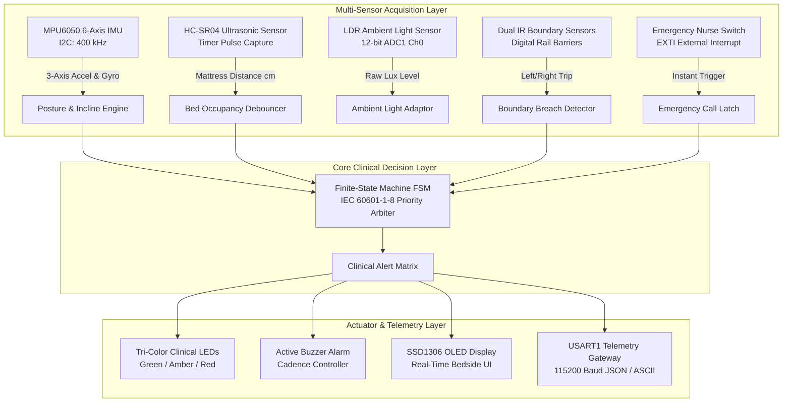
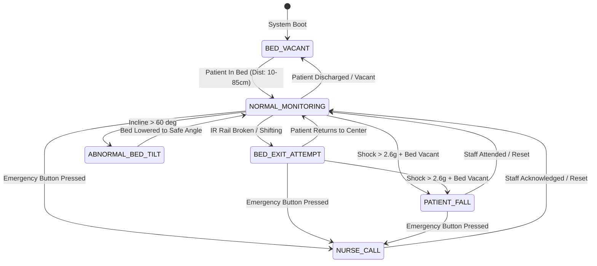

# 🏥 Smart Medical ICU Safety & Patient Monitoring System

[](https://github.com/harshavardhan-estd/smart-icu-patient-monitor/actions)
[](LICENSE)
[-red.svg)](https://www.st.com/)
[](docs/ARCHITECTURE.md)
[](docs/CLINICAL_ALERTS.md)

An intelligent, multi-sensor embedded bedside monitoring prototype engineered in **Modern C (C11)** for Intensive Care Units (ICU), surgical recovery wards, and eldercare facilities.

Powered by the **STM32 Black Pill (ARM Cortex-M4)**, the system performs real-time patient posture evaluation, bed elevation angle monitoring (Fowler's position), non-contact bed-occupancy detection, fall impact recognition, emergency nurse-call arbitration, and ambient light-adaptive displays.

---

## 🌟 Key Highlights & Engineering Features

- **Multi-Sensor Clinical Acquisition**:
  - **MPU6050 6-Axis IMU (I2C)**: Computes patient posture, lateral bed tilt, and head elevation incline angle via kinematic trigonometric fusion ($\theta_{\text{pitch}} = \text{atan2}(a_y, a_z) \cdot \frac{180^\circ}{\pi}$).
  - **HC-SR04 Ultrasonic Sensor**: Non-contact ultrasonic mattress distance tracking with a debounced occupancy filter to eliminate false alarms.
  - **Dual Infrared Boundary Sensors (Active Low GPIO)**: Detects early bed-rail breach and bed-exit attempts before a disoriented or elderly patient falls.
  - **LDR Ambient Light Sensor (12-bit ADC)**: Continuously monitors room lux levels to adapt bedside display brightness and activate dark-room nurse assistance mode.
  - **Emergency Nurse-Call Switch (EXTI Interrupt)**: Zero-latency hardware interrupt guaranteeing immediate top-priority bedside alerts.
- **Deterministic Finite-State Machine (FSM)**:
  - IEC 60601-1-8 compliant clinical alarm arbiter ensuring deterministic priority resolution:
    $$\text{Nurse Call} \succ \text{Patient Fall} \succ \text{Bed Exit Attempt} \succ \text{Abnormal Incline} \succ \text{Bed Vacant}$$
- **Distinct Acoustic Alarm Cadences**:
  - Differentiates emergencies with specific buzzer audio profiles: continuous siren (fall emergency), rapid pulse (nurse call), and intermittent beeps (bed exit / tilt warnings).
- **Zero Hardware Requirement to Evaluate**:
  - **Wokwi Cloud Simulation**: Full virtual circuit with STM32, OLED, MPU6050, Ultrasonic, Buzzer, and LEDs ready to simulate in-browser.
  - **Native Host Emulation**: Compiles directly on host PC (Windows/Linux/macOS) with automated C unit tests verifying all 6 clinical scenarios.

---

## 📐 System Architecture



---

## 🔄 Bedside Finite-State Machine (FSM)



---

## 🚨 Clinical Alarm Priority Matrix

| Clinical Condition | State Enum | IEC 60601-1-8 Priority | Visual Indicator | Acoustic Buzzer Cadence | Protocol / Action |
| :--- | :--- | :--- | :--- | :--- | :--- |
| **Nurse Emergency Call** | `ICU_STATE_NURSE_CALL` | 🔴 **HIGH (Critical)** | Flashing Red LED | Rapid Urgent Pulse (200ms ON / 100ms OFF) | Immediate bedside response required |
| **Patient Fall Detected** | `ICU_STATE_PATIENT_FALL` | 🔴 **HIGH (Critical)** | Steady Red LED | Continuous High-Pitch Siren | Emergency code fall intervention |
| **Bed Exit Attempt** | `ICU_STATE_BED_EXIT_ATTEMPT`| 🟡 **MEDIUM (Warning)**| Steady Amber LED | Intermittent Beep (500ms ON / 500ms OFF) | Assist patient back to safe center |
| **Abnormal Bed Incline** | `ICU_STATE_ABNORMAL_BED_TILT`| 🟡 **MEDIUM (Warning)**| Steady Amber LED | Intermittent Beep (500ms ON / 500ms OFF) | Adjust Fowler angle within $0^\circ - 60^\circ$ |
| **Bed Vacant** | `ICU_STATE_BED_VACANT` | 🟢 **LOW (Info)** | Slow Pulsing Green | Silent | Awaiting patient admission |
| **Normal Monitoring** | `ICU_STATE_NORMAL_MONITORING`| 🟢 **NORMAL (Safe)** | Steady Green LED | Silent | Routine bedside observation |

---

## 📂 Repository Structure

```
smart-icu-patient-monitor/
├── .github/
│   └── workflows/
│       └── ci.yml             # GitHub Actions automated unit test workflow
├── docs/
│   ├── ARCHITECTURE.md        # System block diagram, kinematics & FSM specifications
│   ├── HARDWARE_WIRING.md     # Pinout table, ASCII schematic, and Bill of Materials
│   └── CLINICAL_ALERTS.md     # IEC 60601-1-8 clinical alert priority hierarchy
├── include/
│   ├── icu_config.h           # STM32 Black Pill pinout, timings, and thresholds
│   ├── icu_types.h            # Clinical enums, telemetry structs, and status codes
│   ├── core/
│   │   ├── icu_fsm.h          # Finite-State Machine coordinator
│   │   └── patient_monitor.h  # Posture angles, fall shock, and occupancy algorithms
│   ├── hal/
│   │   └── hal_sensors.h      # Hardware Abstraction Layer & simulation harness
│   └── telemetry/
│       └── icu_telemetry.h    # Bedside JSON & ASCII telemetry serializers
├── src/
│   ├── main.c                 # STM32 target firmware entry point & host simulator
│   ├── core/                  # FSM and algorithmic implementations
│   ├── hal/                   # Sensor drivers and deterministic test scenarios
│   └── telemetry/             # Real-time telemetry generators
├── tests/
│   ├── unity/                 # Embedded Unity test framework
│   ├── test_fsm.c             # State transitions & alert arbitration tests
│   ├── test_patient_monitor.c # Posture angles & fall shock algorithm tests
│   └── run_tests.py           # Automated Python test runner
├── simulation/
│   ├── diagram.json           # Wokwi simulation circuit layout
│   └── wokwi.toml             # Wokwi simulation configuration
├── platformio.ini             # PlatformIO build configuration for STM32 Black Pill
├── CMakeLists.txt             # Native CMake configuration for host builds
├── LICENSE                    # MIT Open Source License
└── README.md                  # Project documentation
```

---

## ⚡ Quick Start: Verification & Testing

### 1. Run Automated Unit Tests (Host Machine)
```bash
python tests/run_tests.py
```
*Test Output:*
```text
====================================================================
  Smart Medical ICU Patient Monitoring - Automated Test Suite
====================================================================
[TOOLCHAIN] Compiler: gcc

--> Building & Running: Bedside Finite-State Machine & Alert Priorities
    [PASS] Bedside Finite-State Machine & Alert Priorities
      PASS: test_fsm_initial_state_vacant
      PASS: test_fsm_nurse_call_overrides_other_alerts
      PASS: test_fsm_fall_detection_triggers_continuous_siren
--> Building & Running: Patient Posture, Fall Shock & Boundary Algorithms
    [PASS] Patient Posture, Fall Shock & Boundary Algorithms
      PASS: test_incline_angle_triggers_abnormal_tilt (Incline: 68 deg -> Warning)
      PASS: test_bed_exit_attempt_triggered_by_ir_rails
--------------------------------------------------------------------
ALL CLINICAL SAFETY & FSM TEST SUITES PASSED (100%).
```

### 2. Run the Native Clinical Scenario Emulator
```bash
gcc -Iinclude -o icu_simulator src/main.c src/core/icu_fsm.c src/core/patient_monitor.c src/hal/hal_sensors.c src/telemetry/icu_telemetry.c -lm
./icu_simulator
```

*Live Telemetry Stream:*
```text
--> Phase 1: Bed Unoccupied / Awaiting Admission
[0000s] STATE: BED_VACANT             | ALARM: INFO            | INCLINE: 20.6 deg | DIST: 120.0 cm | SHOCK: 0.99 g
       STATUS: BED VACANT - Awaiting Admission

--> Phase 2: Patient Admitted / Stable Resting
[0000s] STATE: NORMAL_MONITORING      | ALARM: NONE (Safe)     | INCLINE: 21.9 deg | DIST: 30.0 cm | SHOCK: 0.99 g
       STATUS: PATIENT STABLE - Monitoring

--> Phase 3: Abnormal Bed Incline Angle (> 65 deg)
[0001s] STATE: ABNORMAL_BED_TILT      | ALARM: MEDIUM WARNING  | INCLINE: 67.6 deg | DIST: 35.0 cm | SHOCK: 1.00 g
       STATUS: ADVISORY: Bed Incline Angle Exceeded Safe Limit

--> Phase 4: Bed Exit Attempt (Left IR Barrier)
[0001s] STATE: BED_EXIT_ATTEMPT       | ALARM: MEDIUM WARNING  | INCLINE: 33.9 deg | DIST: 48.0 cm | SHOCK: 1.00 g
       STATUS: WARNING: Bed Exit Attempt Detected!

--> Phase 5: High-G Patient Fall Shock Detected
[0002s] STATE: PATIENT_FALL_EMERGENCY | ALARM: HIGH CRITICAL ALARM | INCLINE: 72.8 deg | DIST: 115.0 cm | SHOCK: 2.87 g
       STATUS: CRITICAL: Patient Fall Emergency!

--> Phase 6: Emergency Nurse Call Button Pressed
[0002s] STATE: NURSE_CALL_ACTIVE      | ALARM: HIGH CRITICAL ALARM | INCLINE: 20.6 deg | DIST: 28.0 cm | SHOCK: 0.99 g
       STATUS: EMERGENCY: Nurse Call Button Pressed!
```

---

## 🛠️ Hardware Pinout & Wiring (STM32 Black Pill)

```
                     +---------------------------------------+
                     |   STM32 Black Pill (Cortex-M4 84MHz)  |
                     |                                       |
    [PB8 (I2C1_SCL)] +---------+----------------+            |
    [PB9 (I2C1_SDA)] +-------+ |                |            |
                     |       | |                |            |
    [PA1 (TRIG)] ----+-------|-|----------------|-------+    |
    [PA2 (ECHO)] ----+-------|-|----------------|-----+ |    |
                     |       | |                |     | |    |
    [PA0 (ADC1_0)] --+-------|-|----------------|---[LDR Divider]
                     |       | |                |            |
    [PA3 (IR_L)] ----+-------|-|----------------|-----[IR Sensor L]
    [PA4 (IR_R)] ----+-------|-|----------------|-----[IR Sensor R]
                     |       | |                |            |
    [PA5 (EXTI5)] ---+-------|-|----------------|---[Nurse Pushbutton]--- GND
                     |       | |                |            |
    [PB0 (BUZZER)] --+-------|-|----------------|---[Active Buzzer]------ GND
    [PB1 (LED_G)] ---+-[330R]|-|-[>| (Green)]---|------------------------ GND
    [PB12(LED_Y)] ---+-[330R]|-|-[>| (Amber)]---|------------------------ GND
    [PB13(LED_R)] ---+-[330R]|-|-[>| (Red)]-----|------------------------ GND
                     +-------|-|----------------+------------+
                             | |                |
                             | |                +--------+
                             | |                         |
                       +-----+---+                 +-----+---+
                       | MPU6050 |                 | SSD1306 |
                       | 6-DoF   |                 | OLED    |
                       +---------+                 +---------+
```

---

## 💻 Target Hardware Deployment (PlatformIO)

To flash onto a physical STM32 Black Pill board:
```bash
# Compile and flash via ST-LINK v2
pio run -e blackpill_f401cc --target upload

# Launch serial telemetry monitor
pio device monitor -b 115200
```

---

## 👨‍💻 Author & Attribution

- **Author**: **Seerapu Harsha Vardhan**
  - **GitHub**: [@harshavardhan-estd](https://github.com/harshavardhan-estd)
  - **LinkedIn**: [harsha-seerapu-2806882b9](https://www.linkedin.com/in/harsha-seerapu-2806882b9)
- **License**: Distributed under the permissive [MIT License](LICENSE).
