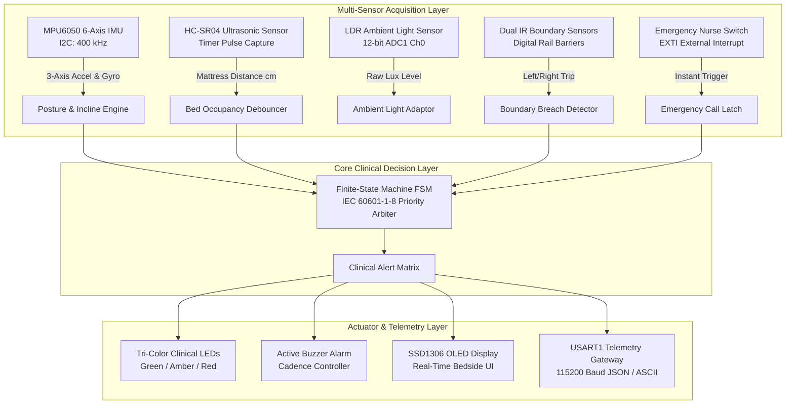
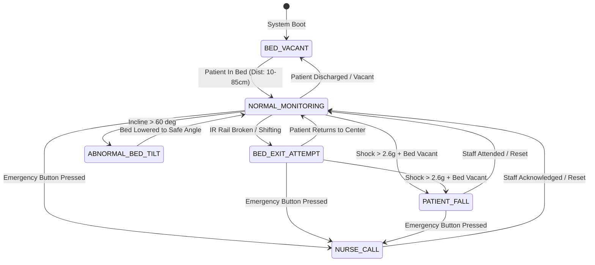

# System Architecture & Clinical Engineering Specification

The **Smart Medical ICU Safety & Patient Monitoring System** is an embedded medical bedside guardian powered by the **STM32 Black Pill (ARM Cortex-M4)**. Designed for Intensive Care Units (ICU), geriatric care, and recovery wards, it continuously monitors patient posture, bed elevation (Fowler's position), bed occupancy, boundary breaches, impact falls, emergency nurse calls, and ambient room lighting.

---

## 1. High-Level System Architecture

---

## 2. Finite-State Machine (FSM) Diagram

---

## 3. Mathematical & Algorithmic Derivations

### 3.1 Posture & Bed Incline Calculation
Using the gravitational acceleration vector from the MPU6050 accelerometer:
$$\vec{A} = [a_x, a_y, a_z]$$
$$\text{Total Acceleration Magnitude} \quad |\vec{A}| = \sqrt{a_x^2 + a_y^2 + a_z^2}$$

The bed head incline (Fowler's position angle $\theta_{\text{pitch}}$) and lateral tilt ($\phi_{\text{roll}}$) are extracted via:
$$\theta_{\text{pitch}} = \text{atan2}(a_y, a_z) \cdot \frac{180^\circ}{\pi}$$
$$\phi_{\text{roll}} = \text{atan2}(a_x, a_z) \cdot \frac{180^\circ}{\pi}$$

*Clinical Safe Zone: $0^\circ \le \theta_{\text{pitch}} \le 60^\circ$. Angles $> 60^\circ$ present aspiration or circulatory hazards and trigger an advisory alert.*

### 3.2 Impact Fall Detection Algorithm
A fall event is distinguished from normal shifting by a dual-stage trigger:
1. **Kinematic Impact**: Peak dynamic acceleration exceeding the critical shock threshold:
   $$|\vec{A}| \ge 2.60g$$
2. **Mattress Disconnect**: Ultrasonic sensor reading exceeds bed boundary ($d > 85\text{ cm}$) or boundary IR sensors break simultaneously.

### 3.3 Bed Occupancy Debounce Filter
To prevent false vacancy alarms caused by patient breathing, coughing, or rolling over, mattress proximity is debounced across $N = 5$ consecutive sample cycles ($250\text{ ms}$).
